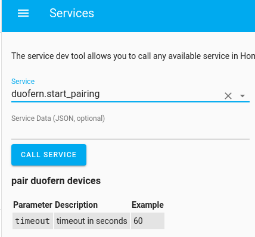

pyduofern-hacs
==============

This repository contains hacs integration for [pyduofern](https://github.com/gluap/pyduofern).

As reported in [#31](https://github.com/gluap/pyduofern/issues/31) 10-Digit codes recently announced by Rademacher are not supported as of now as the handshake/
protocol for these devices was not reverse engineered by anyone as far as I know.

You can use this repo with [hacs](https://hacs.xyz)

Setting up pyduofern in hacs
----------------------------

1. In *HACS->Integrations* on the top right click on **⋮** and select *custom repositories*.

2. Add a repo with URL ``https://github.com/gluap/pyduofern-hacs`` and type **integration**

3. Back in *HACS->Integrations* search for *duofern*

4. In Homeassistant go to *Configuration -> Integrations*, click the + sign to add an integration and search for *dufoern*

5. Complete the setup dialog

Setup with homeassistant core (no Homeassistant OS)
---------------------------------------------------
To use ``pyduofern`` within [Homeassistant](https://home-assistant.io/), add the ``custom_components`` from https://github.com/gluap/pyduofern-hacs  to
``~/.homeassistant/`` directory and enable it by adding the following to your ``configuration.yaml``::

    duofern:
       # (4 hex digits as code required, last 4 digits if migrating from FHEM, 10 digit devices are not supported as of now)
       code: deda
       # Optional options, comment in if required:
       # serial_port: /dev/ttyUSB0
       #   # serial_port defaults to
       #   # /dev/serial/by-id/usb-Rademacher_DuoFern_USB-Stick_WR04ZFP4-if00-port0
       #   # which should work on most linuxes
       # config_file: ~/duofern.json
       #   # config_file defaults to duofern.json in homeassistant folder (assuming custom_component is used)

### Usage

There are some services you can call via the service interface. A few of these to get you started:

``duofern.start_pairing`` starts the pairing mode for a given number of seconds. After pairing reload the integration to make the new devices visible.

``duofern.ask_for_update``

Ask duofern devices to re-send their state in case. Can be used in setups where RF is finnicky.

``duofern.dump_device_state``
Dump the current last received state for all duofern modules as a warning level message to the log. This reflects the current state of all RF messages received from devices - What's not here wasn't received by the stick or came in garbled.

``duofern.sync_devices``
Write the duofern config file with the known devices. normally not required from the user.